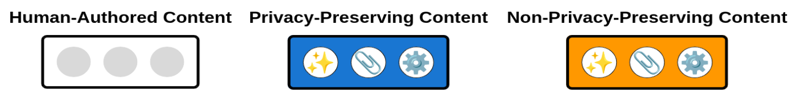
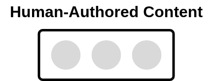
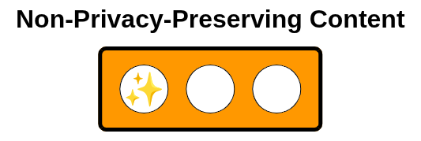
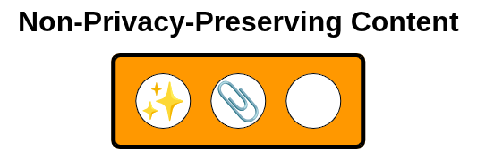
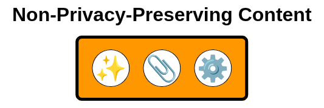

The Gen-AI Content Protocol (GCP) allows authors to clearly declare the use of generative AI tools in documents, while self-assessing their understanding of the associated risks and implications. Specifically, the GCP provides a human-friendly, easy-to-adopt taxonomy that describes how generative AI tools have been used. This taxonomy defines three badges different badges: non–Gen-AI assisted, Gen-AI assisted (private), and Gen-AI assisted.

The GCP is intended for use in any type of document, but especially in academic, scientific, and enterprise contexts, enabling readers to understand the extent to which AI has been used. This initiative is inspired by the TLP, and I recommend using both protocols together when disclosing information.

## Definitions 
The GPD protocol categorizes the usage of generative AI tools into three different categories:

- **Human-Authored Content (⚪)**: The content is fully created by humans. No generative AI tools were used at any stage of content creation, editing, or refinement. 

- **Privacy-Preserving AI-Assisted Content (🔵)**:The tools follow documented protocols ensuring that submitted data is not stored, reused, or incorporated into model training.

- **Non-privacy-preserving AI-content (🟠)**: Generative AI tools were used without explicit guarantees regarding data retention, reuse, or training. In most cases, the privacy and future use of the provided data cannot be fully assured 

Further for AI-asisted content it is described the level of gen-AI usage:  

- **Language Editing only (✨)**: Generative AI tools are used exclusively to improve grammar, spelling, clarity, and writing style. The core ideas of the content remain entirely original and are produced by the author. The AI does not introduce new information or arguments. 

- **AI-Assisted Content Generation (📎)** : The document include sections or paragraphs generated with the assistance of AI tools. In this level, the authorship is original but guided flavoured by generative AI tools. As a result, the generated portions may reflect biases inherent in the sources and train data of the generative AI tool. 

- **AI-Generated Content (⚙️)**: The document is entirely generated by generative AI tools, with minimal or no human authorship involved in the creation of the content. Consequently, the output may be influenced by biases present in the AI’s training data, sources, or model assumptions. 

## Usage 
Simply select the badge that suits your content and include it in your document. As a best practice, link to this page to allow readers to obtain more information about the GCP protocol.

<table>
  <thead>
    <tr>
      <th>Category</th>
      <th>Badge</th>
      <th>Description</th>
      <th>When to use</th>
    </tr>
  </thead>
  <tbody>
    <!-- Human-authored -->
    <tr>
      <td>Human-Authored Content</td>
      <td>
        
      </td>
      <td>Content fully created by humans without AI assistance.</td>
      <td>Patentable information, confidential contracts and internal legal reports.</td>
    </tr>
    <!-- Privacy-preserving AI -->
    <tr>
      <td rowspan="3">Privacy-preserving AI-assisted content</td>
      <td>
        
      </td>
      <td> Language Editing only</td>
      <td rowspan="3">Scientific papers, anonymized research reports, internal documentation, University reports and thesis.</td>
    </tr>
    <tr>
      <td>
        
      </td>
      <td>AI-Assisted Content Generation</td>
    </tr>
    <tr>
      <td>
        
      </td>
      <td>AI-generated content </td>
    </tr>
    <!-- Non-privacy-preserving AI -->
    <tr>
      <td rowspan="3">Non-privacy-preserving AI-assisted content</td>
      <td>
        
      </td>
      <td>Language Editing only</td>
      <td rowspan="3">Blog posts, press releases, social media, or open-access educational materials.</td>
    </tr>
    <tr>
      <td>
        
      </td>
      <td>AI-Assisted Content Generation</td>
    </tr>
    <tr>
      <td>
        
      </td>
      <td>AI-generated content </td>
    </tr>
  </tbody>
</table>

## Contributing
If you want to contribute to this initiative, I’d love to hear from you! You can:

- Send me a PM with ideas, suggestions, or questions.

- Report issues if you spot bugs. 

- Spread the word by sharing this project with others.

## License 
This project is licensed under a MIT 2025 License. 